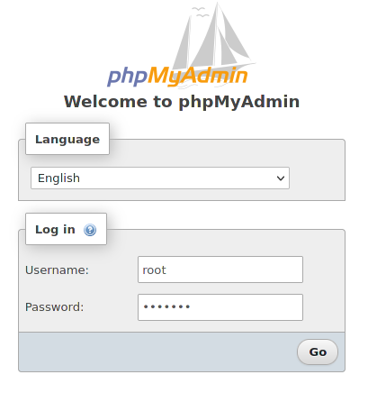
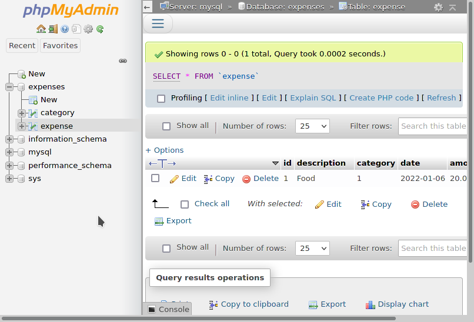
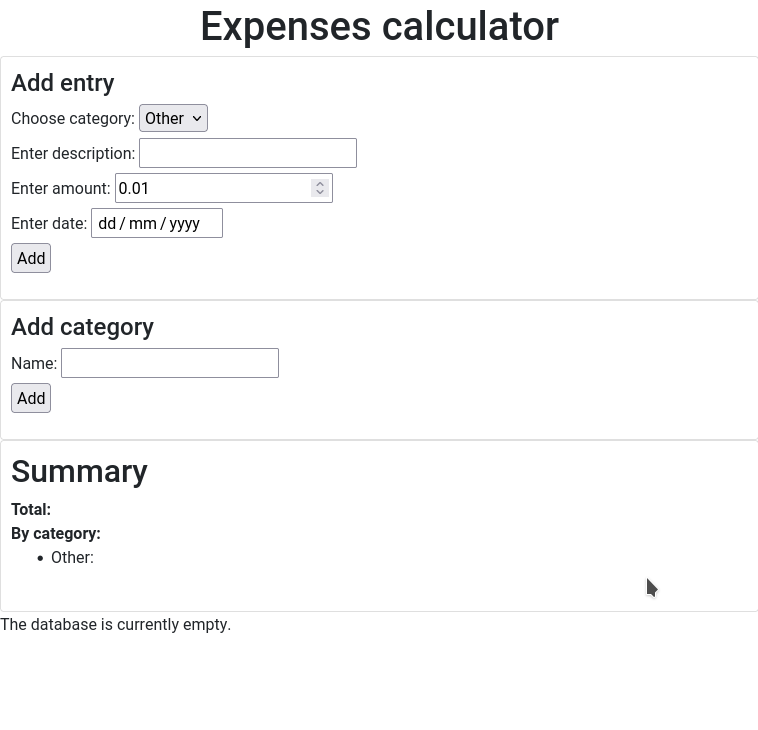
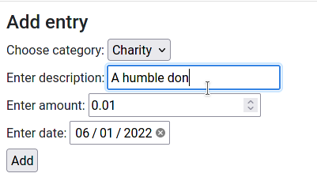
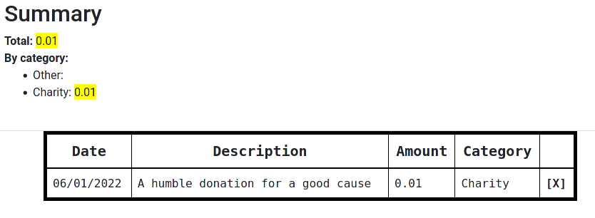
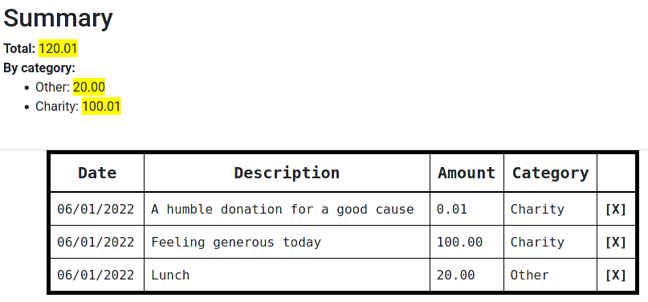
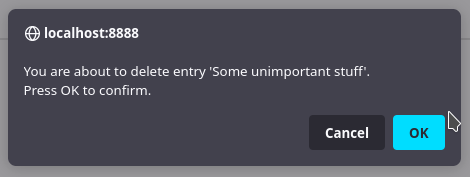

# Expenses calculator
A simple web app for keeping track of expenses, running on docker containers.

# Prerequisites
You should install [Docker](https://www.docker.com/) in order to successfully launch the application. Depending on the OS you intend to run the project on, this may include a bit of work. Please refer to the [Docker installation guide](https://docs.docker.com/get-docker/) for more details.  

Installing Docker via Docker Desktop should also provide you with docker-compose, which is the other required dependency. If something unexpected happens (or if you are using Linux), you can manually install it by following [this guide](https://docs.docker.com/compose/install/).

# How to launch
After installing the mentioned packages, running `docker-compose up` in a terminal (bash, cmd, powershell, etc.) opened in the main project directory (the one with [docker-compose.yaml](docker-compose.yaml)) should start the app. When it starts up, visiting http://localhost:8888 [^1] in a web browser of your choice should display the calculator.

[PHPMyAdmin](https://www.phpmyadmin.net/) is also provided should you want to view/change the data used by the app, manually.  
Its web interface is accessible on http://localhost:8889 [^1] while the app is running. To login, use `root` as the username. You can find (and change) the default password (`Privz3toGesl0`) in the [.env](.env) file.  
 

# Using the app
When you open the app for the first time, you will be greeted by a screen similar to the one on the image below.
   
As can be seen on the screenshot, the app's database is currently empty. You can **add entries** onto the expenses list by filling out the **Add entry** section:
* **Category**: You can divide your expenses into categories. One category, `Other`, is already present by default, but you can add more in the **Add category** section below. 
* **Description**: You can set a description (your notes) here.
* **Amount**: The amount you spent. The combined value of all expenses will be displayed in the **Summary** section.
* **Date**: Here you can specify the date the expense took place.
By clicking on the **Add** button, the entry will be added to the database and subsequently displayed in the table on the bottom of the page.[^2]

  
The **Summary** section provides an overview of total combined expenses as well as the sum of expenses by a particular category for each category defined in the database, as can be seen on the screenshot below.
  
Clicking on the **\[X\]** button of a table entry will delete the entry, allowing the user to cancel the action via a confirmation dialog.[^3]   
  

# Details
This application stack consists of four docker containers:
* The main web server (the "calculator" app)
  * Dockerfile: [apache/Dockerfile](apache/Dockerfile)
  * Using image **php:7.4.3-apache**
* The PHPMyAdmin server
  * Dockerfile: [phpmyadmin/Dockerfile](phpmyadmin/Dockerfile)
  * Using image **phpmyadmin/phpmyadmin:5**
* MariaDB
  * Dockerfile: [mysql/Dockerfile](mysql/Dockerfile)
  * Using image **mariadb:10.7.1**
  * Uses a volume (`data`), bound to `/var/lib/mysql` on the container
* A reverse proxy container
  * Built using multi-stage builds
  * Dockerfile: [proxy/Dockerfile](proxy/Dockerfile)
  * Using image: **nginx**

The latter is built in a multi-stage manner, first generating two SSL keys/certificates on an Alpine image and then copying them onto an nginx image. It listens for incoming HTTP connections and redirects them to one of the two HTTPS virtual hosts - for the calculator app and PHPMyAdmin, respectively - depending on the source port, using the generated certificates.

The main app's backend is written in PHP, using [PDO](https://www.php.net/manual/en/intro.pdo.php) to connect to the MySQL/MariaDB container. Data is stored in the `data` folder (bound using the `volumes` directive in [docker-compose.yaml](docker-compose.yaml) to the mysql data directory) in order for it to persist in case you remove the containers or stop the app using `docker-compose down`.

# Plans for the future
This app is currently in some kind of a demo stage, missing some useful features such as:
* Styling (currently looking a bit plain)
* Form validation (posting invalid values - such as the placeholder date - when adding an entry will process the action, but fail silently)
* Configurable row sorting
* Filtering data based on the date, multiple categories, or user preferences
* Maybe a currency converter?
* ...

[^1]: If docker-compose displays an error such as `Bind for 0.0.0.0:8888 failed: port is already allocated`, another application may be occupying one or more ports the calculator is configured to use. To remedy such a situation, alter line 43 or 44 of [docker-compose.yaml](docker-compose.yaml), depending on the problematic port, by changing the number **on the left-hand side of the `:` symbol** to a port number not already being used on your system. For example, setting line 43 to `- "1234:8888"` should instruct docker-compose to use port `1234` instead, in which case the app will then be available on http://localhost:1234. **Do not change the number on the right-hand side as it will render the app unusable.**
[^2]: The rows are displayed sorted by date, oldest entries first.
[^3]: Please note that deleting entries is irreversible.